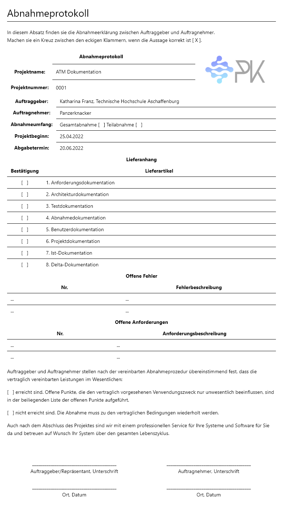

# Abnahmedokumentation

## System Under Test

 
System Under Test bezieht sich auf die validierung des Systems.
 
 
Das system wird unter verschiedenen Szenarien getestet. Die Anforderungsspezifikationen werden den Testfällen zugeordnet, um zu überprüfen, ob alle Anforderungen erfüllt sind.
 
 
 
Die folgende Tabelle beinhaltet die Testfälle und Testergebnisse. Für detallierte Testspezifikationen sehe Testdokumentation.
 
 
Bestanden: Testergebnisse wie erwartet
 
Nicht bestanden: Testergebnisse wie nicht erwartet.
 
 

| Testfall                       | Testergebnis |
| ------------------------------ | ------------ |
| Sind Komponenten initialisiert | Bestanden    |
| Wechsel in BALANCE Modus       | Bestanden    |
| Falscher Input in Menü         | Bestanden    |
| "Back" Button                  | Bestanden    |
| "Clear" Button                 | Bestanden    |
| Ungültiger Pin Input           | Bestanden    |
| Neuen Account erstellen        | Bestanden    |
| Credit und Debit Funktion      | Bestanden    |

 
Die folgende Tabelle beinhaltet die User Stories und deren Ergebnisse. Für detallierte User Stories sehe Anforderungsdokumentation.
 
 
Implementiert: User Stories erfolgreich implementiert
 
Nicht Implementiert: User Stories nicht erfolgreich implementiert
 
 

| Nr. | User Stories                                      | Testergebnis                  |
| --- | ------------------------------------------------- | ----------------------------- |
| 1   | ...Verschiedene Geldbeträge eingeben...           | Implementiert                 |
| 2   | ...Sehen, wie viel Geld auf  Konto ist...         | Implementiert                 |
| 3   | ...maximal Debit Betrag pro Tag festlegen...      | Implementiert                 |
| 4   | ...vierstellige Pin zu meiner Karte eingeben...   | Implementiert                 |
| 5   | ...Ziffern meiner Pin ändern...                   | Implementiert                 |
| 6   | ...Länge meiner Pin ändern...                     | Implementiert (Administrator) |
| 7   | ...Stückelung auswählen...                        | Nicht Implementiert           |
| 8   | ...auf meinem Konto einloggen...                  | Implementiert                 |
| 9   | ...gegen Gebühren Geld abheben...                 | Implementiert  FEHLER         |
| 10  | ...vollständige und detaillierte Dokumentation... | Implementiert                 |

 

## Bereitstellung zur Abnahme

