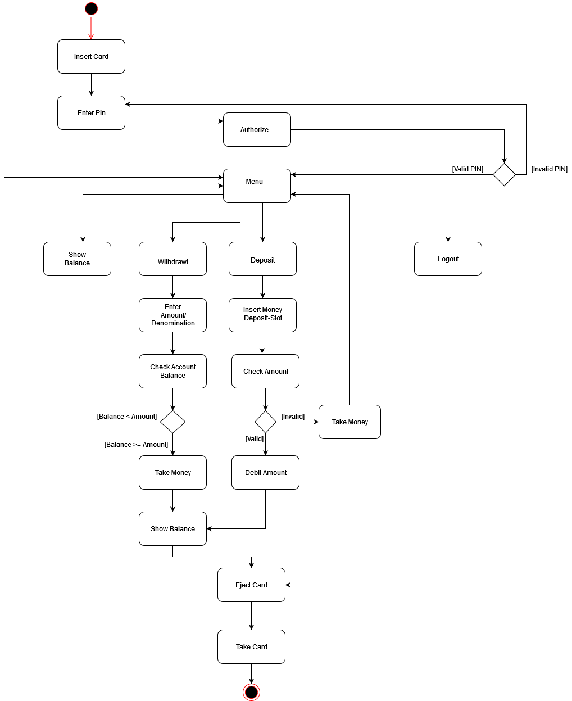

# Architekturdokumentation

## Beschreibung der Systemarchitektur

### Priorisierung der nicht funktionalen Anforderungen

> Beschreibt wie gut ein System/Produkt eine bestimmte Funktion erfüllt

- Gute Benutzerfreundlichkeit und Bedienbarkeit
- Hohe Performance bei Operationen wie Guthaben abrufen, einzahlen und auszahlen
- Kurze Start-Zeit (Account-Initialisierung)

### Architekturprinzipien

> Nach welchen Kriterien soll das System in Komponenten unterteilt werden?
> Welche Aspekte sollen in Komponenten zusammengefasst werden?
> Welche Dienstleistungen sollen Komponenten nach außen an ihrer Schnittstelle anbieten, welche Aspekte müssen geschützt sein?
> Wie sollen die Komponenten miteinander interagieren?
> Wie sollen Komponenten strukturiert und verfeinert werden?

### Schnittstellen

- UI mit den Java-Swing GUI Bibliotheken
- `KeypadListener.java` für Kommunikationsschnittstelle zwischen dem Tastenfeld und dem Bildschirm Objekt
- `ATMListener.java` ist die Schnittstelle zum Haupt-ATM-Objekt, in der Aktionen, wie ein Wechsel in einen anderen Modus oder das Betätigen der Enter-Taste behandelt werden

### Big Picture der Systemarchitektur

## Systementwurf

### Systemdekomposition

Das System lässt sich hauptsächlich durch die Bestandteile `Show Balance`, `Withdrawal`, `Deposit` und `Admin View` beschreiben. Zusätzlich gibt es ein `Menü` und eine `Login`, sowie eine `Logout` Funktion.

Vom Menü aus, ist es einem Benutzer möglich alle relevanten Funktionalitäten durch das Drücken einer Zahl zu erreichen. Die Funktion `atmSwitchModeAction()` wechselt nun, je nach eingegebener Zahl, in den entsprechenden Modus. Eine weitere wichtige Komponente des System ist das `Keypad`, welches die verschiedenen Knöpfe darstellt. Dieses befindet sich immer in der linken Hälfte des Fensters und hilft dem Nutzer bei der Bedienung des Automaten. Es wird in dem Konstruktor der Klasse `Screen.java` zusammen mit dem SidePanel initialisiert.

Das `SidePanel` hat, wie das Keypad, eine eigene Klasse. Es befindet sich auf der rechten Hälfte des Fensters und beinhaltet unter anderem einen „Back-Button“. Mit diesem kann zurück in den „Menü-Modus“ gewechselt werden. In dem SidePanel befindet sich außerdem das Textfeld, in welchem die Benutzereingabe angezeigt wird, sowie ein JLabel. Dieses zeigt, je nach Modus, zum Beispiel das verfügbare Geld, oder die verschiedenen Optionen mit entsprechender Eingabe an.

Eine weitere Funktionalität ist die `Admin View`. Loggt sich ein Admin ein öffnet sich ein neues Fenster. In diesem können die Daten der Benutzer geändert und anschließend gespeichert werden.

### Designalternativen und –Entscheidungen

Es wurde sich dazu entschieden die einzelnen Funktionalitäten mit Hilfe von verschiedenen Modi zu implementieren. Der Bankautomat befindet sich zu jedem Zeitpunkt in einem bestimmten Modus und reagiert, je nach Modus, unterschiedlich auf bestimmte Eingaben. Dieser Ansatz unterscheidet sich stark von der ursprünglichen Version des Automaten. Hier gab es keine Modi und die verschiedenen Funktionen, wie das Geldabheben, wurden von eigenen Klassen übernommen.

In der alten Version des Bankautomaten, konnte ein Admin mit Hilfe eines Iterators auf die einzelnen Benutzer zugreifen. In dem überarbeiteten Modell ist es möglich, aus einer Liste von Benutzern auf den gewünschten Benutzer zu klicken. Dies ermöglicht eine einfachere und schnellere Bearbeitung.

Zudem wird das Speichern der verschiedenen Benutzer nicht mehr innerhalb einer Java-Klasse übernommen, sondern außerhalb in einer JSON-Datei. Die Benutzerdaten werden, mit Hilfe der Klasse „BankDatabase“ in diese Datei übertragen.

### Cross-Cutting-Concerns, NFRs

Ein Benutzer soll in jedem Modus eine Eingabe tätigen können. Daher wurde das Keypad und ein entsprechendes Textfeld so implementiert, dass diese Komponenten stets sichtbar und verfügbar sind. Andere Komponenten werden teilweise unsichtbar gemacht, da diese nicht in jedem Modus gebraucht werden.

Ein weiterer Cross-Cutting-Concern ist das Geben von passendem Feedback an den Benutzer. Hier soll dem Benutzer, unabhängig von dem aktuellen Modus, stets mitgeteilt werden, wenn er eine ungültige Eingabe getätigt hat. Für diese Art von Fehlermeldungen wurde im untersten Bereich des Fensters ein Textfeld angelegt, welches die jeweilige Nachricht in roter Farbe anzeigt.

Außerdem ist die Validierung des Inputs bei einem Bankautomaten äußerst wichtig. Deshalb werden die Eingaben stets auf Richtigkeit überprüft. So wird beispielsweise sichergestellt, dass das eingezahlte Geld keinen Maximalwert überschreitet. Ebenso muss sichergestellt werden, dass ein Benutzer nicht mehr Geld abheben kann, als gerade für ihn verfügbar ist.

## Mensch-Maschine-Schnittstelle

### Anforderungen an die Mensch-Maschine-Schnittstelle

Die Mensch-Maschine-Schnittstelle, oder auch Benutzerschnittstelle, bezieht sich auf die Kommunikation zwischen einem Nutzer (Mensch) und dem Geldautomaten (Maschine).
Der Mensch gibt mit seinen Aktoren (Händen) eine Eingabe-Information an die Peripherieeinheiten des Geldautomaten, welche eine digitale Information an die Recheneinheit des Geldautomaten weiterleiten. Die von der Recheneinheit entgegengenommene Information wird mittels der aufgespielten Software verarbeitet und eine Ausgabe-Information wird erzeugt. Die Recheneinheit steuert digital die Peripherieeinheiten des Geldautomaten an, welche eine optische (Bildschirm-Ausgabe) und mechanische Ausgabe Information (Geldauszahlung) erzeugen. Die Rückgabe-Informationen werden vom Menschen visuell (Bildschirm-Information) und haptisch (Annahme des ausgezahlten Geldes) verarbeitet.

| Ein-/Ausgabe | **Mensch Schnittstelle** | **Hardware Schnittstelle**                | **Software Schnittstelle** |
| ------------ | ------------------------ | ----------------------------------------- | -------------------------- |
| **Eingabe**  | Hände                    | Encrypting PIN Pad                        | Tastenabfrage              |
|              | Augen                    | ID-Kartenleser, Softkeys oder Touchscreen | Touchbildschirm Abfrage    |
| **Ausgabe**  | Hände                    | Bildschirm                                | Grafikausgabe              |
|              | Augen                    | Auszahlmodul                              | Peripherie Ansteuerung     |

### Gestaltungsprinzipien und Style-Guide

Gestaltungsprinzipien

Gesetze:
>1.	Gesetz der Nähe
>>•	Logisch zusammengehörige Informationen
werden auch örtlich zusammen gruppiert.
Unterschiede in der Hierarchie o. ä. werden
durch räumliche Trennung realisiert.
>2.	Gesetz der Gleichartigkeit
>>•	Zusammengehörige Informationen,
z. B. Feldbezeichner, werden gleichartig
dargestellt.
>3.	Gesetz der guten Gestalt
>>•	Der Mensch bevorzugt in seiner Wahrnehmung gute Gestalten (symmetrisch...)

Eigenschaften:
>1.	Einfachheit
>2.	Regelmäßigkeit
>3.	Symmetrie
>4.	Inners Gleichgewicht

Der Benutzer soll jederzeit sehen können:
>1.	Wo bin ich?
>2.	Wie kam ich hierhin?
>3.	Was kann ich hier tun?
>4.	Wohin und wie kann ich navigieren?

### Interatkionsmodellierung

Benutzer:

Geld abheben

>1.	Der Benutzer Inseriert seine Bankkarte. ATM zeigt das Authentifizierungsmenü an.
>2.	Der Benutzer gibt sein Passwort ein um sich zu authentifizieren. ATM Zeigt das Menü zu weiteren Auswahl an.
>4.	Der Benutzer drückt „Abbruch“. ATM zeigt Menü zur weiteren Auswahl an.
>5.	Der Benutzer Wählt Betrag und Stückelung. ATM zahlt Betrag in gewünschter Stückelung aus, zeigt neuen Kontostand an und wirft Bankkarte aus.
>6.	Der Benutzer nimmt die Karte. ATM zeigt Willkommens Bildschirm

Geld einzahlen

>1.	Der Benutzer Inseriert seine Bankkarte. ATM zeigt das Authentifizierungsmenü an.
>2.	Der Benutzer gibt sein Passwort ein um sich zu authentifizieren. ATM Zeigt das Menü zu weiteren Auswahl an.
>3.	Der Benutzer drückt „Geld einzahlen“ . ATM zeigt Informationsbildschirm und öffnet Deposit-Slot.
>4.	Benutzer drückt „Abbruch“. ATM zeigt Menü zur weiteren Auswahl an.
>5.	Benutzer legt Bargeld in den Deposit-Slot.
>6.	Benutzer drückt „Bestätigen“. ATM schließt den Deposit-Slot, validiert die Eingabe, bei erfolgreicher Prüfung wird der betrag dem Bankkonto gutgeschrieben und das Menü zu weiteren Auswahl angezeigt.
>7.	Benutzer drückt „Bestätigen“. ATM schließt den Deposit-Slot, validiert die Eingabe und bei nicht erfolgreicher Prüfung wird Deposit-Slot wieder geöffnet. 
>8.	Benutzer entnimmt das Bargeld. ATM wirft Bankkarte aus und zeigt Willkommens Bildschirm an. 
>9.	Der Benutzer nimmt die Karte. ATM zeigt Willkommens Bildschirm an.

Kontostand anzeigen

>1.	Der Benutzer Inseriert seine Bankkarte. ATM zeigt das Authentifizierungsmenü an.
>2.	Der Benutzer gibt sein Passwort ein um sich zu authentifizieren. ATM Zeigt das Menü zu weiteren Auswahl an.
>3.	Benutzer drückt „Kontostand anzeigen“. ATM zeigt Bildschirm mit Kontostand und Datum.
>4.	Benutzer drückt „Weitere Auswahl“. ATM zeigt Bildschirm zur weiteren Auswahl an.

Logout

>1.	Der Benutzer Inseriert seine Bankkarte. ATM zeigt das Authentifizierungsmenü an.
>2.	Der Benutzer gibt sein Passwort ein um sich zu authentifizieren. ATM Zeigt das Menü zu weiteren Auswahl an.
>3.	Der Benutzer drückt „Logout“. ATM wirft Bankkarte aus.
>4.	Der Benutzer nimmt die Karte. ATM zeigt Willkommens Bildschirm an. 

 

