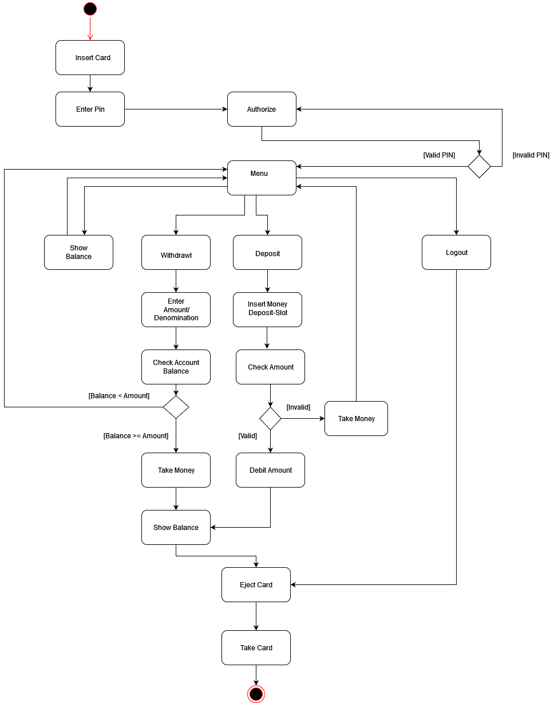

# Architekturdokumentation

## Beschreibung der Systemarchitektur

### Priorisierung der nicht funktionalen Anforderungen

> Beschreibt wie gut ein System/Produkt eine bestimmte Funktion erfüllt

- Gute Benutzerfreundlichkeit und Bedienbarkeit
- Hohe Performance bei Operationen wie Guthaben abrufen, einzahlen und auszahlen
- Kurze Start-Zeit (Account-Initialisierung)

### Architekturprinzipien

> Nach welchen Kriterien soll das System in Komponenten unterteilt werden?
> Welche Aspekte sollen in Komponenten zusammengefasst werden?
> Welche Dienstleistungen sollen Komponenten nach außen an ihrer Schnittstelle anbieten, welche Aspekte müssen geschützt sein?
> Wie sollen die Komponenten miteinander interagieren?
> Wie sollen Komponenten strukturiert und verfeinert werden?

### Schnittstellen

- UI mit den Java-Swing GUI Bibliotheken
- `KeypadListener.java` für Kommunikationsschnittstelle zwischen dem Tastenfeld und dem Bildschirm Objekt
- `ATMListener.java` ist die Schnittstelle zum Haupt-ATM-Objekt, in der Aktionen wie ein Wechsel in einen anderen Modus oder das Betätigen der Enter-Taste behandelt werden

### Big Picture der Systemarchitektur

## Systementwurf

### Systemdekomposition

### Designalternativen und –Entscheidungen

### Cross-Cutting-Concerns, NFRs

## Mensch-Maschine-Schnittstelle

### Anforderungen an die Mensch-Maschine-Schnittstelle

Die Mensch-Maschine-Schnittstelle, oder auch Benutzerschnittstelle, bezieht sich auf die Kommunikation zwischen einem Nutzer (Mensch) und dem Geldautomaten (Maschine).
Der Mensch gibt mit seinen Aktoren (Händen) eine Eingabe-Information an die Peripherieeinheiten des Geldautomaten, welche eine digitale Information an die Recheneinheit des Geldautomaten weiterleiten. Die von der Recheneinheit entgegengenommene Information wird mittels der aufgespielten Software verarbeitet und eine Ausgabe-Information wird erzeugt. Die Recheneinheit steuert digital die Peripherieeinheiten des Geldautomaten an, welche eine optische (Bildschirm-Ausgabe) und mechanische Ausgabe Information (Geldauszahlung) erzeugen. Die Rückgabe-Informationen werden vom Menschen visuell (Bildschirm-Information) und haptisch (Annahme des ausgezahlten Geldes) verarbeitet.

<<<<<<< HEAD

| Ein-/Ausgabe | **Mensch Schnittstelle**     | **Hardware Schnittstelle**   | **Software Schnittstelle**   |
| ------------ | ---------------------------- | ---------------------------- | ---------------------------- |
| **Eingabe**  | Hände                        | Encrypting PIN Pad           | Tastenabfrage                |
|              | Augen                        | ID-Kartenleser               | Touchbildschirm Abfrage      |
|              | -                            | Softkeys oder Touchscreen    |                              |
|              | ---------------------------- | ---------------------------- | ---------------------------- |
| **Ausgabe**  | Hände                        | Bildschirm                   | Grafikausgabe                |
|              | Augen                        | Auszahlmodul                 | Peripherie Ansteuerung       |
=======
| Ein-/Ausgabe | **Mensch Schnittstelle**     | **Hardware Schnittstelle**   | **Software Schnittstelle**   |
| ------------ | ---------------------------- | ---------------------------- | ---------------------------- |
| **Eingabe**  | Hände                        | Encrypting PIN Pad           | Tastenabfrage                |
|              | Augen                        | ID-Kartenleser               | Touchbildschirm Abfrage      |
|              |                              | Softkeys oder Touchscreen    |                              |
|              | ---------------------------- | ---------------------------- | ---------------------------- |
| **Ausgabe**  | Hände                        | Bildschirm                   | Grafikausgabe                |
|              | Augen                        | Auszahlmodul                 | Peripherie Ansteuerung       |
>>>>>>> 5f44fefdafbaeede31f98b0f7bd0a133bb5c0411

### Gestaltungsprinzipien und Style-Guide

Gestaltungsprinzipien

Gesetze:
>1.	Gesetz der Nähe
>>•	Logisch zusammengehörige Informationen
werden auch örtlich zusammen gruppiert.
Unterschiede in der Hierarchie o. ä. werden
durch räumliche Trennung realisiert.
>2.	Gesetz der Gleichartigkeit
>>•	Zusammengehörige Informationen,
z. B. Feldbezeichner, werden gleichartig
dargestellt.
>3.	Gesetz der guten Gestalt
>>•	Der Mensch bevorzugt in seiner Wahrnehmung gute Gestalten (symmetrisch...)

Eigenschaften:
>1.	Einfachheit
>2.	Regelmäßigkeit
>3.	Symmetrie
>4.	Inners Gleichgewicht

Der Benutzer soll jederzeit sehen können:
>1.	Wo bin ich?
>2.	Wie kam ich hierhin?
>3.	Was kann ich hier tun?
>4.	Wohin und wie kann ich navigieren?

### Interatkionsmodellierung

Benutzer:

Geld abheben

>1.	Der Benutzer Inseriert seine Bankkarte. ATM zeigt das Authentifizierungsmenü an.
>2.	Der Benutzer gibt sein Passwort ein um sich zu authentifizieren. ATM Zeigt das Menü zu weiteren Auswahl an.
>4.	Der Benutzer drückt „Abbruch“. ATM zeigt Menü zur weiteren Auswahl an.
>5.	Der Benutzer Wählt Betrag und Stückelung. ATM zahlt Betrag in gewünschter Stückelung aus, zeigt neuen Kontostand an und wirft Bankkarte aus.
>6.	Der Benutzer nimmt die Karte. ATM zeigt Willkommens Bildschirm

Geld einzahlen

>1.	Der Benutzer Inseriert seine Bankkarte. ATM zeigt das Authentifizierungsmenü an.
>2.	Der Benutzer gibt sein Passwort ein um sich zu authentifizieren. ATM Zeigt das Menü zu weiteren Auswahl an.
>3.	Der Benutzer drückt „Geld einzahlen“ . ATM zeigt Informationsbildschirm und öffnet Deposit-Slot.
>4.	Benutzer drückt „Abbruch“. ATM zeigt Menü zur weiteren Auswahl an.
>5.	Benutzer legt Bargeld in den Deposit-Slot.
>6.	Benutzer drückt „Bestätigen“. ATM schließt den Deposit-Slot, validiert die Eingabe, bei erfolgreicher Prüfung wird der betrag dem Bankkonto gutgeschrieben und das Menü zu weiteren Auswahl angezeigt.
>7.	Benutzer drückt „Bestätigen“. ATM schließt den Deposit-Slot, validiert die Eingabe und bei nicht erfolgreicher Prüfung wird Deposit-Slot wieder geöffnet. 
>8.	Benutzer entnimmt das Bargeld. ATM wirft Bankkarte aus und zeigt Willkommens Bildschirm an. 
>9.	Der Benutzer nimmt die Karte. ATM zeigt Willkommens Bildschirm an.

Kontostand anzeigen

>1.	Der Benutzer Inseriert seine Bankkarte. ATM zeigt das Authentifizierungsmenü an.
>2.	Der Benutzer gibt sein Passwort ein um sich zu authentifizieren. ATM Zeigt das Menü zu weiteren Auswahl an.
>3.	Benutzer drückt „Kontostand anzeigen“. ATM zeigt Bildschirm mit Kontostand und Datum.
>4.	Benutzer drückt „Weitere Auswahl“. ATM zeigt Bildschirm zur weiteren Auswahl an.

Logout

>1.	Der Benutzer Inseriert seine Bankkarte. ATM zeigt das Authentifizierungsmenü an.
>2.	Der Benutzer gibt sein Passwort ein um sich zu authentifizieren. ATM Zeigt das Menü zu weiteren Auswahl an.
>3.	Der Benutzer drückt „Logout“. ATM wirft Bankkarte aus.
>4.	Der Benutzer nimmt die Karte. ATM zeigt Willkommens Bildschirm an. 

 

