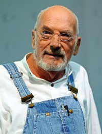
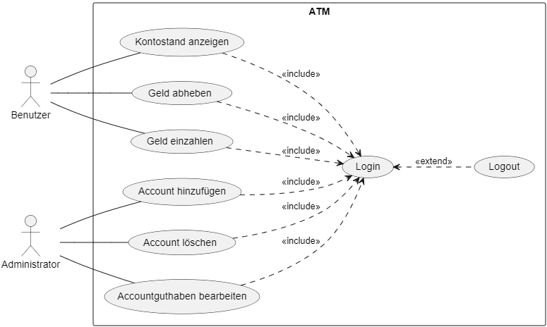

# Anforderungsdokumentation

## Produktvision und Produktziele

### Produktvision

Eine regionale Bank hat unser externes Software-Entwicklerteam für einen Auftrag eingestellt. Bei dem uns übertragenem Projekt handelt es sich um die fehlerhafte Software einer ATM (Automated Teller Machine) zu deutsch Bankautomat. Der bereits existente Programmcode wurde von einem externen Unternehmen entwickelt, so dass der Kunde kein Expertenwissen zum Programm verfügt, außerdem fehlt auch die Dokumentation vollständig.

Um dem Bankunternehmen nun die Verwendung des Systems zu ermöglichen, muss das Programm komplett überarbeitet werden, darüber hinaus soll eine detaillierte Dokumentation (vollständig in deutsch) für die Bank erstellt werden. Das fehlerfreie Programm mit den bereits integrierten Features und einer strukturierten Dokumentation ist unser Basisfaktor. Das Programm ist für die Bankautomaten der Bank in Deutschland vorgesehen. Die Dokumentation soll die Entwicklung sowie die Funktionen der Software zusammenfassen und den zuständigen Mitarbeiter verständlich machen.

### Produktziele

Die Aufgabe unseres Teams ist es den bereits vorhandenen Code so zu überarbeiten, dass dieser voll funktionsfähig ist und eine sichere Laufzeit gewährleistet werden kann. Zur Entwicklung der Software ist eine vollständig deutsche Dokumentation vorgesehen mit **Anforderungs**-, **Architektur**-, **Test**-, **Abnahme**-, **Benutzer**-, **Projekt**-, und **Codedokumentation**.

## Rollen und Personas

### Rollen

Hier werden die Rollen beschrieben, denen ein Benutzer angehören kann.

| Rollen        | Beschreibung                                                                                |
| ------------- | ------------------------------------------------------------------------------------------- |
| Benutzer      | Die Benutzer sind Kunden der Bank, die den Geldautomaten zur Verfügung stellt               |
| Administrator | Administratoren des Bankautomatensystems, die Verwaltungsrechte über alle Benutzer besitzen |

### Personas

Personas veranschaulichen typische Vertreter Ihrer Zielgruppe.

| Gertrude Gabel          |  |
| ----------------------- | ------------------------------------------- |
| Rolle                   | Benutzer                                    |
| Alter                   | 65                                          |
| Geschlecht              | weiblich                                    |
| Tätigkeit               | Rentnerin                                   |
| Familienstand           | verheiratet                                 |
| Bildung                 | Mittelschule                                |
| Computerkenntnisse      | Keine                                       |
| Interessen und Hobbies  | Wandern, Kaffee trinken                     |
| Einstellung zum Produkt | "Eine tolle Maschine, tut was sie soll"     |
| Wünsche                 | Einfache Bedienung, wenig zum Merken        |

 

| Peter Lustig            |                   |
| ----------------------- | --------------------------------------------------- |
| Rolle                   | Benutzer                                            |
| Alter                   | 38                                                  |
| Geschlecht              | männlich                                            |
| Tätigkeit               | Handwerker                                          |
| Familienstand           | verheiratet                                         |
| Bildung                 | Realschule                                          |
| Computerkenntnisse      | Grundkenntnisse                                     |
| Interessen und Hobbies  | Autos, Actionfilme, Fahrradfahren                   |
| Einstellung zum Produkt | "Hoffentlich werden die neuen Geldautomaten besser" |
| Wünsche                 | Nützliche Funktionen, Schnelle Bedienbarkeit        |

 

| Andy Auman              |                |
| ----------------------- | --------------------------------------------- |
| Rolle                   | Administrator                                 |
| Alter                   | 29                                            |
| Geschlecht              | männlich                                      |
| Tätigkeit               | Systemadministrator                           |
| Familienstand           | ledig                                         |
| Bildung                 | Abitur                                        |
| Computerkenntnisse      | Fachkenntnisse                                |
| Interessen und Hobbies  | Programmierung, Netzwerke, Gaming             |
| Einstellung zum Produkt | ""                                            |
| Wünsche                 | Viele Funktionen, Wenig Konfigurationsaufwand |

 

| Mathias Jung            |  |
| ----------------------- | ---------------------------------------- |
| Rolle                   | Benutzer                                 |
| Alter                   | 19                                       |
| Geschlecht              | männlich                                 |
| Tätigkeit               | Student                                  |
| Familienstand           | ledig                                    |
| Bildung                 | Abitur                                   |
| Computerkenntnisse      | Grundkenntnisse                          |
| Interessen und Hobbies  | BWL / Wirtschaft                         |
| Einstellung zum Produkt | ""                                       |
| Wünsche                 | Schnelle und Einfache Transaktionen      |

## User Stories

User Stories sind Wünsche an eine Software, die aus Sicht des Endbenutzers verfasst wurden.

> Als **[Rolle]** möchte ich **[Ziel/Wunsch]**, um **[Nutzen]**

  1. Als **Benutzer** möchte ich **verschiedene Geldbeträge eingeben**, um diese abzuheben
  2. Als **Benutzer** möchte ich **sehen, wie viel Geld auf meinem Konto** ist, um zu wissen, wie viel ich noch abheben kann
  3. Als **Benutzer** möchte ich eine **maximal Debit Betrag pro Tag festlegen** können, um bei Diebstahl den Verlust zu minimieren
  4. Als **Benutzer** möchte ich eine **vierstellige Pin zu meiner Karte eingeben** müssen, um Gelddiebstahl von meinem Konto zu vermeiden
  5. Als **Benutzer** möchte ich die **Ziffern meiner Pin ändern** können, um sie mir besser merken zu können
  6. Als **Benutzer** möchte ich die **Länge meiner Pin ändern** können, um die Sicherheit zu verbessern
  7. Als **Benutzer** möchte ich eine **Stückelung auswählen** können, um gewünschte Scheine zu erhalten
  8. Als **Benutzer** möchte ich mich **auf meinem Konto einloggen** können, um getätigte Transaktionen zu sehen
  9. Als **Mitglied einer anderen Bank** möchte ich **gegen Gebühren Geld abheben** können, um örtlich flexibel zu sein
  10. Als **Administrator** der Bank möchte ich eine **vollständige und detaillierte Dokumentation**, um im Fehlerfall schnell handeln zu können

## Aufgaben

Auflistung aller Aufgaben dieses Projektes.

- Anfertigen einer Ist-Dokumentation des Codes
- Funktionen aus User Stories implementieren
- Codeverbesserungen in Delta-Dokumentation beschreiben
- Anfertigen einer Anforderungsdokumentation
- Anfertigen einer Systemdokumentation
- Anfertigen einer Testdokumentation
- Anfertigen einer Abnahmedokumentation
- Anfertigen einer Benutzerdokumentation
- Anfertigen einer Projektdokumentation

## Begriffslexikon

Hier werden alle fachspezifische Begriffe aufgelistet, die in diesem Projekt verwendet werden.

| **Begriff**        | **Bedeutung**                     |
| ------------------ | --------------------------------- |
| **Cash Dispenser** | Bargeld im ATM-Dispenser          |
| **Deposit Slot**   | Geldfach zum Ein- und Auszahlen   |
| **Balance**        | Ist-Saldo auf einem Account       |
| **Withdrawal**     | Geld abheben                      |
| **Account Pin**    | Geheimpin eines Accounts (unique) |
| **Account number** | Nummer eines Accounts (unique)    |
| **Credit**         | Gutschrift                        |
| **Debit**          | Maximale Auszahlung pro Tag       |

## Mengengerüst

Das Mengengerüst beschreibt quantitativ die Komponenten eines Projektes.

| **Bezeichnung**   | **Beschreibung**                      | **Menge** | **Einheit** |
| ----------------- | ------------------------------------- | --------- | ----------- |
| **Pin**           | Stellenanzahl der Pin                 | 4         | Stellen     |
| **Geldautomaten** | Anzahl Geldautomaten in Aschaffenburg | 43        | Stück       |
| **Debit**         | Maximale Auszahlung pro Tag           | 1000      | Euro        |
| **Nutzer**        | Maximale Nutzer gleichzeitig          | 1         | Person      |
| **Nutzer**        | Maximal registrierte Nutzer           | >1000     | Person      |
| **Transaktion**   | Maximale Transaktion pro Minute       | ~100      | Transaktion |

## Use Cases

In diesem Anwendungsfalldiagramm wird das nach außen sichtbare Verhalten des Systems aus Sicht der Nutzer beschrieben.

