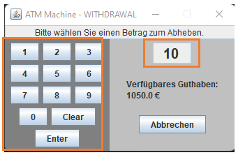
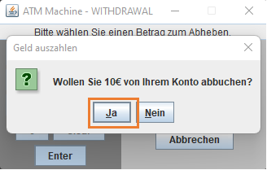
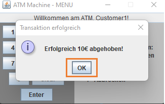
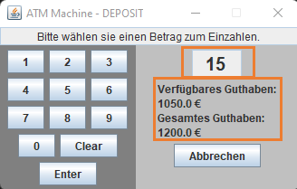
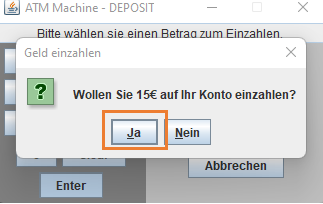

# Benutzerdokumentation
## In diesem Dokument wird die Benutzerdokumentationen, in Form eines Benutzerhandbuchs mit Text und Bild beschrieben.
## Allgemeine Funktionen

## Im Folgenden wird die Authenitifizierung mit dem ATM und einem Benutzer aufgeführt.
### Authentifizieren
>Der Benutzer sieht zunächst den „Willkommens Bildschirm“ mit der Forderung seine Karte einzustecken. 
>
>Nachdem die Karte eingeführt wurde, wird der Benutzer aufgefordert, sich durch die Eingabe seines „PIN“, auf dem „Keypad“, zu Authentifizieren. 
>
>Die Eingabe des „PIN“, muss mit „Enter“ bestätigt werden.  
Nach erfolgreichem „Login“ , wird entweder die Kunden-Ansicht, oder die Admin-Ansicht angezeigt.

Kunden-Ansicht (Menü) 
>

Admin-Ansicht (Admin-Menü) 
>

## Im Folgenden wird eine Anleitung zur Benutzung des ATM, mit einem Kunden, zu verschiedenen Optionen dargestellt.

## Kunde
## Geld abheben

> 1. Der Benutzer wählt "Geld abheben" aus. ATM zeigt das verfügbare Guthaben an und erfordert die Eingabe des Betrags. 
> 
> 2. Der Benutzer gibt den gewünschten Betrag ein und drückt "Enter". ATM fordert Bestätigung. 
> 
> 3. Der Benutzer bestätigt das Geld abzubuchen. ATM Bestätigt die Auszahlung.
> 
> 4. Der Benutzer drück auf "OK". ATM zeigt das Menü an.
> 

## Geld einzahlen

> 1. Der Benutzer wählt „Geld einzahlen“ . ATM zeigt das verfügbare Guthaben an und erfordert die Eingabe des Betrags. 
> 
> 2. Der Benutzer gibt den gewünschten Betrag ein und drückt "Enter". ATM fordert Bestätigung. 
> 
> 3. Benutzer drückt „JA“. ATM validiert die Eingabe. Bei erfolgreicher Prüfung wird der Betrag dem Bankkonto gutgeschrieben und der Informationsbildschirm wird angezeigt. 
> 
> 4. Benutzer drückt "OK". ATM zeigt das Menü an. 
> 

## Kontostand anzeigen

> 1. Benutzer wählt „Kontostand anzeigen“. ATM zeigt Bildschirm mit Kontostand an.
> 
> 
> 2. Benutzer drückt „Abbrechen“. ATM zeigt das Menü an.
> 

## Logout

> 1. Der Benutzer wählt „Abbrechen“, bestätigt mit "Enter". ATM zeigt Willkommens Bildschirm an. 
> 

## Im Folgenden wird eine Anleitung zur Benutzung des ATM, mit einem Administrator, zu verschiedenen Optionen dargestellt.  

## Administrator

## Account hinzufügen

> 1. Administrator drückt „Neuer Account“. ATM erzeugt ein neues Konto.
> 
> 2. Administrator gibt Accountdaten ein und drückt "Speichern". ATM Zeigt Informationsbildschirm an. 
> 
> 3. Administrator drückt "OK". ATM zeigt das Admin-Menü an.
> 

## Account löschen

> 1. Administrator wählt einen account aus und drückt "Löschen". ATM erfordert bestätigung. 
> 
> 2. Adminstrator bestätigt das Löschen. ATM löscht das Konto und Zeigt Informationsbildschirm an. 
> 
> 3. Administrator drückt "OK". ATM zeigt das Admin-Menü an.
> image.png

## Account bearbeiten

> 1. Administrator wählt einen Account aus, gibt die gewünschte änderung ein und drückt "Speichern". ATM zeigt Informationsbildschirm an. 
> 
> 
> 2. Administrator drückt "OK". ATM zeigt das Admin-Menü an.
> 